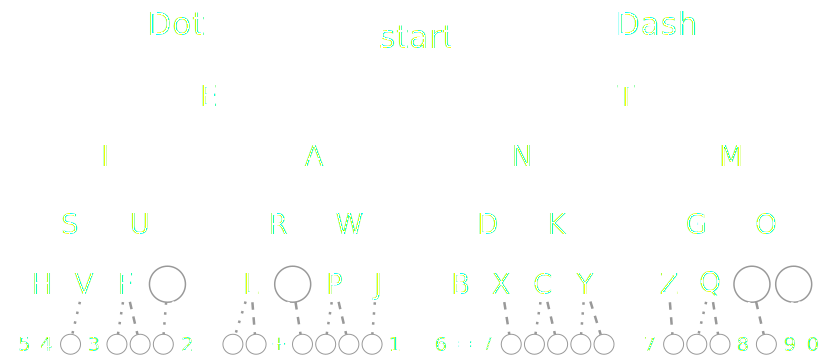

# Morse Binary Tree
Using a binary tree to translate Morse code into Ascii text.

## What is Morse code?
Morse code is a system of communication that uses a series of dots and dashes to represent letters and numbers. It was developed in the 1830s by Samuel Morse, an American artist and inventor, as a way to communicate over long distances using telegraphy.

### Morse code alphabet as a binary tree.
Morse code is a perfect match for the binary search tree algorithm, because Morse code has only two characters "-" and ".". When searching for a character for Morse code, it is enough to follow the instructions left or right. By which the search time is reduced to a minimum, and the Big-O notation is O(log N).



## Usage
    Usage: ./morse-binary-tree "MORSE CODE"
    
    Translate Morse code into Ascii text using a binary tree.
    
    For more information or to report bugs, add me on discord sopa#7417

Show help menu without giving any arguments.

## Getting the source
Download the source code by running the following code in your command prompt:
```sh
$ git clone https://github.com/jsob0/morse-binary-tree.git
```
or simply [grab](https://github.com/jsob0/morse-binary-tree/archive/main.zip) a copy of the source code as a Zip file.

## Building
Create the build directory.
```sh
$ mkdir build
$ cd build
```
The translator requires CMake and a C compiler (e.g. Clang or GCC) in order to run.
Then, simply create the Makefiles:
```sh
$ cmake ..
```
and finally, build it using the building system you chose (e.g. Make):
```sh
$ make
```
Run the translator by specifying the Morse code.
```sh
$ ./morse-binary-tree ".... . .-.. .-.. --- / .-- --- .-. .-.. -.."
```

## License
The code is released under the MIT License. See [LICENSE](/LICENSE).
